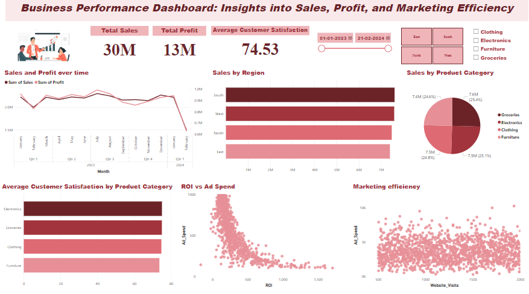

# Business Performance Dashboard Project



## Project Overview
This project focuses on developing an interactive dashboard to analyze business performance metrics, enabling data-driven decision-making. The dashboard provides insights into sales, profit, expenses, customer satisfaction, and marketing efficiency, leveraging a dataset with 10,000 records across multiple dimensions.

---

## Key Features

- **Profit and Sales Analysis**:
  - Track trends in sales and profit over time.
  - Compare regional and product category performance.

- **Marketing Insights**:
  - Visualize the relationship between ad spend and ROI.
  - Analyze website traffic and its impact on revenue.

- **Customer Satisfaction Metrics**:
  - Evaluate customer satisfaction scores by region and product category.

- **Interactivity**:
  - Dynamic slicers and drill-through capabilities for tailored data exploration.

---

## Dataset
- **Source**: Custom-generated dataset with 10,000 records.
- **Columns**:
  - Date
  - Sales
  - Expenses
  - Profit
  - Region
  - Customer Satisfaction Score
  - Website Visits
  - Ad Spend
  - Product Category

---

## Technologies Used

### Tools
- **Power BI**: For dashboard creation and data visualization.

### Metrics and Calculations
- **Profit Margin (%)**: `(Profit / Sales) * 100`
- **ROI on Ad Spend (%)**: `(Profit / Ad Spend) * 100`

---

## How to Use

1. **Clone Repository**:
   ```bash
   git clone https://github.com/Abinesh-Data-Analyst/# Business-Performance-Dashboard-Insights-into-Sales-Profit-and-Marketing-Efficiency.git
   ```

2. **Open the Power BI File**:
   - Launch Power BI Desktop.
   - Open the `.pbix` file included in this repository.

3. **Interact with the Dashboard**:
   - Use slicers to filter by date, region, and product category.
   - Explore visuals for insights into business performance.

---

## Actionable Insights

- Identify high-performing regions and product categories.
- Monitor profit margins and optimize expense management.
- Improve marketing efficiency by analyzing ROI and website traffic.

---

## Future Enhancements

- Integrate real-time data feeds.
- Implement predictive analytics using machine learning models.
- Deploy the dashboard for web-based access.

---

## Acknowledgments
Special thanks to the data analytics community for inspiration and guidance.

---

Feel free to explore, fork, and contribute to this project! Reach out if you have any questions or suggestions.


